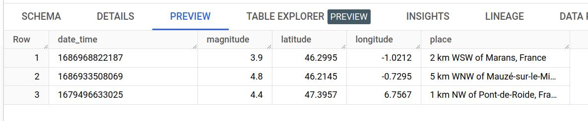

# Earthquake Detection and Storage Application
<!-- To Do: Replace the repository name with the correct one if the repository goes public. The badge below is an example. -->


## Overview
This Python application retrieves earthquake data from the [USGS API](https://earthquake.usgs.gov/fdsnws/event/1/), filters the results based on proximity to known Pleo office locations by default, and stores the data in Google BigQuery. It also supports custom location, period, and radius inputs.

## Features:
- Fetch earthquake data from the USGS API.
- Filter earthquakes by proximity to Pleo office locations.
- Store earthquake data in Google BigQuery.
- Support for custom location, period, and radius inputs.

* `--lat`: Optional latitude override (must be provided with `--lon`). Type: `float`. Valid range: -90.0 to 90.0 degrees.
* `--lon`: Optional longitude override (must be provided with `--lat`). Type: `float`. Valid range: -180.0 to 180.0 degrees.
* `--start_time`: Optional start date override. Type: `string` (Format: `YYYY-MM-DD`, default=`"2023-01-01"`). Must be earlier than `--end_time` and no later than the current date.
* `--end_time`: Optional end date override. Type: `string` (Format: `YYYY-MM-DD`, default=`"2023-12-31"`). Must be later than `--start_time` and no later than the current date.
* `--radius`: Optional maximum radius in kilometers. Type: `float`. Must be between 0 and 20001.6 km (default=`500.0`).

ℹ️ Note: Specifying `lat` and `lon` will override the default Pleo office locations.


## Local installation

1. Clone the repository:
    ```bash
    git clone git@github.com:Serg-Mir/earthquake-app.git
    cd earthquake-app
    ```
2. Run in the terminal:
   ```bash
   python -m venv ~/.earthquake-app
   ```
3. Activate the virtual environment:
   ```bash
   source ~/.virtualenvs/earthquake-app/bin/activate
   ```

4. Install the dependencies:
   ```bash
   pip install -r requirements/base.txt
   ```

5. Consider overriding default settings in the `.env` file:
   - You can customize settings such as `USGS_API_URL`, `bq_table_id`, and other configuration parameters by creating a `.env` file in the project root.
   - The settings will be loaded automatically at runtime, allowing you to tailor the application to your needs.
   - Example `.env` file:
     ```
     DEBUG=True
     USGS_API_URL=https://your-custom-url.com
     BQ_TABLE_ID=your_project.your_dataset.your_table
     ```
6. Set up [GOOGLE_APPLICATION_CREDENTIALS](#setting-up-google-cloud-credentials) env variable in order to save data on BigQuery:
   ```bash
   export GOOGLE_APPLICATION_CREDENTIALS=~/credentials/earthquake-data-436210-a18aafd4ce1e.json
   ```
7. Run the app:
    ```bash
    $ python earthquake_app/main.py
    ```
8. Run the app with custom inputs:
   ```bash
   $ python earthquake_app/main.py --lat 13.006395484423336 --lon 42.734473054904896 --radius 650.0
   ```

## Setting up Google Cloud Credentials

To enable the application to store data in Google BigQuery, you'll need to provide the `GOOGLE_APPLICATION_CREDENTIALS` JSON file, which contains your Google Cloud service account credentials.

1. Follow the official Google Cloud documentation to [create a service account key](https://cloud.google.com/iam/docs/creating-managing-service-account-keys).
2. Download the JSON key file and set the path to the file using the `GOOGLE_APPLICATION_CREDENTIALS` environment variable as shown in the Docker setup or when running locally.

> For more information, visit the [Google Cloud documentation](https://cloud.google.com/docs/authentication/getting-started).


## Docker setup

Make sure you have [Docker](https://docs.docker.com) installed in your local machine.

Create a Docker image from the Earthquake App project:

```bash
DOCKER_BUILDKIT=1 docker build \
  --ssh default \
  --tag earthquake-app \
  .
```

**Note:** If you are using MacOS, you may need to run `ssh-add` to add private key identities to the
authentication agent first for this to work.

You can run the Docker container in local once the image is built:

```bash
docker run --env-file .env --env GOOGLE_APPLICATION_CREDENTIALS="/path/to/credentials/file.json" earthquake-app <ARGUMENTS>
```
## Testing
1. You may need to add the project root directory to the
[`PYTHONPATH`](https://docs.python.org/3/using/cmdline.html#envvar-PYTHONPATH). Run the following command to do so:

   ```bash
   export PYTHONPATH="{$PYTHONPATH}:/absolute/path/to/project"
   ```
2. Install related dependencies
   ```bash
   pip install -r requirements/development.txt
   ```
3. Run
   ```bash
   pytest tests/
   ```


## Contributing

Before starting to contribute to earthquake-app, please install `pre-commit` to ensure your changes are checked for style and standards before committing them to the repository:

    $ pre-commit install

[pre-commit](https://pre-commit.com) is installed automatically in development environment by pip.
If you are running the Docker setup, please install it with `pip` in your host machine:

    $ pip install pre-commit


## Usage examples
Below are examples demonstrating default usage, custom inputs, and using the pre-built Docker container.
### Default values(pre-defined known offices locations)
```text
$ python earthquake_app/main.py
INFO: [earthquake_app.process:fetch_earthquakes_near_offices:13] Earthquake data found for 2 km WSW of Marans, France
INFO: [earthquake_app.process:fetch_earthquakes_near_offices:16] Successfully stored in BigQuery.
---
INFO: [earthquake_app.process:fetch_earthquakes_near_offices:13] Earthquake data found for 5 km S of Rudna, Poland
INFO: [earthquake_app.process:fetch_earthquakes_near_offices:16] Successfully stored in BigQuery.
---
INFO: [earthquake_app.process:fetch_earthquakes_near_offices:13] Earthquake data found for Azores-Cape St. Vincent Ridge
INFO: [earthquake_app.process:fetch_earthquakes_near_offices:16] Successfully stored in BigQuery.
---
INFO: [earthquake_app.process:fetch_earthquakes_near_offices:13] Earthquake data found for 4 km S of Lanjarón, Spain
INFO: [earthquake_app.process:fetch_earthquakes_near_offices:16] Successfully stored in BigQuery.
---
INFO: [earthquake_app.process:fetch_earthquakes_near_offices:13] Earthquake data found for 2 km SE of Cheadle, United Kingdom
INFO: [earthquake_app.process:fetch_earthquakes_near_offices:16] Successfully stored in BigQuery.
---
```
### Custom coordinates and radius
```text
$ python earthquake_app/main.py --lat 13.006395484423336 --lon 42.734473054904896 --radius 650
INFO: [earthquake_app.process:fetch_earthquakes_custom_zone:22] Earthquake data found for 154 km NNW of Las Khorey, Somalia
INFO: [earthquake_app.utils:store_in_bigquery:43] Data stored successfully.
---
```
### Using pre-built docker container
```text
$ docker run --env GOOGLE_APPLICATION_CREDENTIALS=earthquake-data-436210-a18aafd4ce1e.json earthquake-app --lat 35 --lon 44 --radius 660
INFO: [earthquake_app.process:fetch_earthquakes_custom_zone:22] Earthquake data found for 8 km N of Doğanyol, Turkey
INFO: [earthquake_app.utils:store_in_bigquery:43] Data stored successfully.
---

```
### Stored data example from BQ side



## Further Improvements and Ideas:
1. Consider adding validation to check if data already exists on BigQuery, focusing on specific fields to maintain data integrity.
2. Add additional optional [parameters](https://earthquake.usgs.gov/fdsnws/event/1/#extensions) as input arguments, such as event types or maximum magnitude, for more refined queries.
3. Explore potential Machine Learning applications for predicting upcoming earthquakes using such historical data.
4. Implement visualization enhancements to display earthquake data on maps or graphs.
5. Improve error handling for API requests and data processing, providing informative user feedback.
6. Investigate batch processing to handle large data volumes efficiently.
7. Expand user documentation to include more examples, FAQs, and troubleshooting tips.
